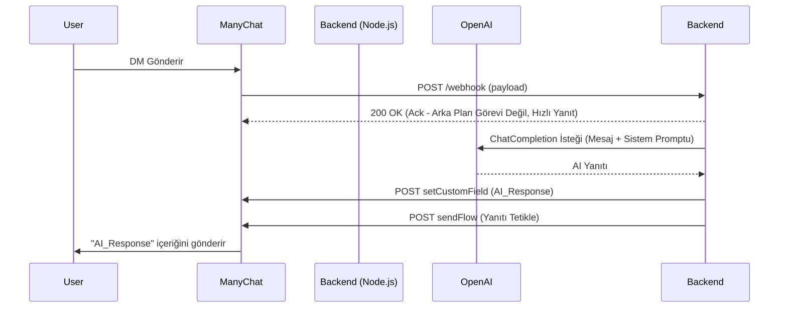

# Sistem Desenleri (System Patterns)

## Mimari
Sistem **Webhook-Worker-API** desenini izler. Backend teknolojisi olarak **Node.js (Express + TypeScript)** kullanılacaktır.

## Temel Desenler
1.  **Asenkron İşleme:** Node.js'in doğası gereği I/O işlemleri asenkron yönetilir (Promise/async-await). Webhook yanıtı (`res.sendStatus(200)`) işlem bitmeden gönderilebilir, işlem arka planda devam eder.
2.  **İki Adımlı Yanıt:**
    -   **Adım 1:** ManyChat'te Özel Kullanıcı Alanını (`AI_Response`) üretilen metinle güncelle.
    -   **Adım 2:** Bu alanı gösteren spesifik Akışı (`Send AI Response`) tetikle.
3.  **Stateless (Durumsuz) Tasarım:** Veritabanı yok. Konfigürasyon `.env` dosyasından.
4.  **Admin API:** Admin Panelinin testi (`/admin/test`) ve konfigürasyon kaydı için RESTful uç noktalar.

## Hata Yönetimi
-   **OpenAI Hataları:** Hataları yakala (try/catch), logla (`console.error` veya `winston`).
-   **Güvenlik:** Webhook'ta token doğrulama (opsiyonel).
